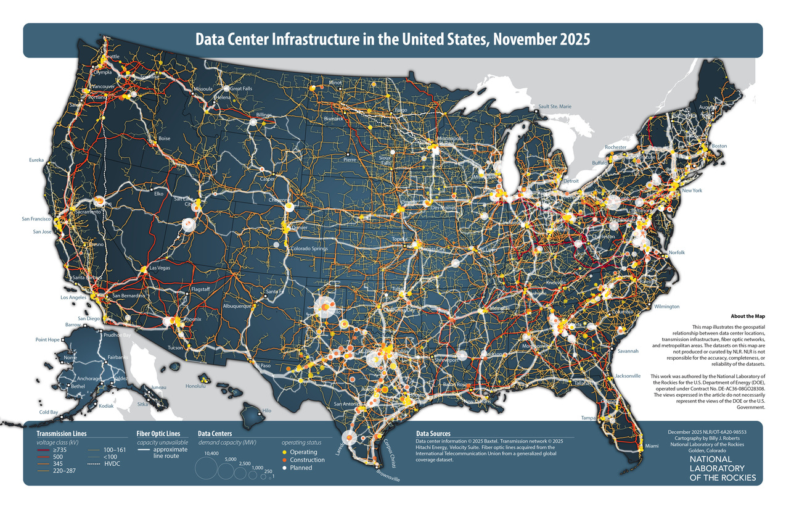

# CIFAR through the tubes: Downloading data from the internet



[Image Credit: B. J. Roberts, NLR](https://research-hub.nlr.gov/en/publications/data-center-infrastructure-in-the-united-states-november-2025-2/)

The aim of this tutorial is to introduce you to command-line tools that are useful for downloading data from the internet and verifing the data is correct. The dataset we'll be working with is the [CIFAR-10 dataset](https://www.cs.toronto.edu/~kriz/cifar.html), a well-known machine learning dataset that consists of 60K 32x32 colour images broken out into 10 classes, with 6000 images per class.

## Login and Setup a Working Directory

Login into Expanse with your account either directly via `ssh` or through the [Expanse User Portal](https://portal.expanse.sdsc.edu)

*Command*
```
ssh <username>@login.expanse.sdsc.edu
```

*Output*
```
mkandes@hardtack:~$ ssh mkandes@login.expanse.sdsc.edu
(mkandes@login.expanse.sdsc.edu) TOTP code for mkandes: 522652
Welcome to Bright release         9.0

                                                         Based on Rocky Linux 8
                                                                    ID: #000002

--------------------------------------------------------------------------------

                                 WELCOME TO
                  _______  __ ____  ___    _   _______ ______
                 / ____/ |/ // __ \/   |  / | / / ___// ____/
                / __/  |   // /_/ / /| | /  |/ /\__ \/ __/
               / /___ /   |/ ____/ ___ |/ /|  /___/ / /___
              /_____//_/|_/_/   /_/  |_/_/ |_//____/_____/

--------------------------------------------------------------------------------

Use the following commands to adjust your environment:

'module avail'            - show available modules
'module add <module>'     - adds a module to your environment for this session
'module initadd <module>' - configure module to be loaded at every login

-------------------------------------------------------------------------------
Last login: Mon Apr 20 12:49:26 2026 from 216.15.51.171
[mkandes@login02 ~]$
```

Once you are logged in, create a working directory for the tutorial exercises in your [home directory](https://en.wikipedia.org/wiki/Home_directory) using the [`mkdir`](https://en.wikipedia.org/wiki/Mkdir) command.

*Command*
```
mkdir -p complecs/
```

*Output*
```
[mkandes@login02 ~]$ mkdir -p complecs/
[mkandes@login02 ~]$
```

Check that the directory was created by listing the contents of your home directory with the [`ls`](https://en.wikipedia.org/wiki/Ls) command. 

*Command*
```
ls
```

*Output*
```
[mkandes@login02 ~]$ ls
complecs  containers  data  projects  scripts  software
[mkandes@login02 ~]$
```

Then navigate into the new working directory using the [`cd`](https://en.wikipedia.org/wiki/Cd_(command)) to make it your [`pwd`](https://en.wikipedia.org/wiki/Pwd).

*Command*
```
cd complecs/
```

*Output*
```
[mkandes@login02 ~]$ cd complecs/
[mkandes@login02 complecs]$ pwd
/home/mkandes/complecs
[mkandes@login02 complecs]$ ls -lahtr
total 308K
drwxr-xr-x  2 mkandes use300  2 Apr 20 12:53 .
drwxr-x--- 29 mkandes use300 46 Apr 20 15:28 ..
[mkandes@login02 complecs]$
```

# Download a Tarball and Extract the Files

Download the CIFAR-10 dataset using [wget](https://en.wikipedia.org/wiki/Wget), a command-line program for retrieving files via HTTP, HTTPS, FTP and FTPS protocols.

*Command*  
```
wget https://js2.jetstream-cloud.org:8001/swift/v1/sdsc-public/datasets/cifar/10/cifar-10-python.tar.gz
```

*Output*
```
[mkandes@login02 complecs]$ wget https://www.cs.toronto.edu/~kriz/cifar-10-python.tar.gz
--2026-04-20 15:46:00--  https://www.cs.toronto.edu/~kriz/cifar-10-python.tar.gz
Resolving www.cs.toronto.edu (www.cs.toronto.edu)... 128.100.3.30
Connecting to www.cs.toronto.edu (www.cs.toronto.edu)|128.100.3.30|:443... connected.
HTTP request sent, awaiting response... 200 OK
Length: 170498071 (163M) [application/x-gzip]
Saving to: ‘cifar-10-python.tar.gz’

cifar-10-python.tar.gz           100%[==========================================================>] 162.60M  36.8MB/s    in 4.9s    

2026-04-20 15:46:06 (33.2 MB/s) - ‘cifar-10-python.tar.gz’ saved [170498071/170498071]

[mkandes@login02 complecs]$
```

After the download completes, go ahead and list the files in your working directory using the `ls`command to check out how much data we've downloaded.

*Command*
```
ls -lahtr
```

*Output*
```
[mkandes@login02 complecs]$ ls -lahtr
total 163M
-rw-r--r--  1 mkandes use300 163M Jun  4  2009 cifar-10-python.tar.gz
drwxr-x--- 29 mkandes use300   46 Apr 20 15:28 ..
drwxr-xr-x  2 mkandes use300    3 Apr 20 15:46 .
[mkandes@login02 complecs]$ 
```

The dataset we've downloaded has been delieved to us as a [`gzip`](https://en.wikipedia.org/wiki/Gzip)-compressed `tar` file. To extract the dataset from this *tarball*, use the [`tar`](https://en.wikipedia.org/wiki/Tar_(computing)) command.

*Command*
```
tar -xf cifar-10-python.tar.gz
```

*Output*
```
[mkandes@login02 complecs]$ tar -xf cifar-10-python.tar.gz 
[mkandes@login02 complecs]$ ls -lahtr
total 164M
drwxr-xr-x  2 mkandes use300   10 Jun  4  2009 cifar-10-batches-py
-rw-r--r--  1 mkandes use300 163M Jun  4  2009 cifar-10-python.tar.gz
drwxr-x--- 29 mkandes use300   46 Apr 20 15:28 ..
drwxr-xr-x  3 mkandes use300    4 Apr 20 15:49 .
[mkandes@login02 complecs]$
```

With the data extracted from the tarball to a directory, let's check out what's inside.

*Command*
```
ls -lahtr cifar-10-batches-py/
```

*Output*
```
[mkandes@login02 complecs]$ ls -lahtr cifar-10-batches-py/
total 177M
-rw-r--r-- 1 mkandes use300 30M Mar 30  2009 test_batch
-rw-r--r-- 1 mkandes use300 30M Mar 30  2009 data_batch_3
-rw-r--r-- 1 mkandes use300 30M Mar 30  2009 data_batch_2
-rw-r--r-- 1 mkandes use300 30M Mar 30  2009 data_batch_5
-rw-r--r-- 1 mkandes use300 30M Mar 30  2009 data_batch_1
-rw-r--r-- 1 mkandes use300 30M Mar 30  2009 data_batch_4
-rw-r--r-- 1 mkandes use300 158 Mar 30  2009 batches.meta
-rw-r--r-- 1 mkandes use300  88 Jun  4  2009 readme.html
drwxr-xr-x 2 mkandes use300  10 Jun  4  2009 .
drwxr-xr-x 3 mkandes use300   4 Apr 20 15:49 ..
[mkandes@login02 complecs]$
```

What type of files are these? Let's check the [CIFAR-10](https://www.cs.toronto.edu/~kriz/cifar.html) website again. See [pickle](https://en.wikipedia.org/wiki/Serialization#Python). 

## Check Data Integrity

How do we know the data we've downloaded from the internet is correct? How do we prove we all have the same data? Hash it. 

Let's start with the traditional [`md5sum`](https://en.wikipedia.org/wiki/Md5sum) command-line program. 

*Command*
```
md5sum cifar-10-python.tar.gz
```

*Output*
```
[mkandes@login02 complecs]$ md5sum cifar-10-python.tar.gz
c58f30108f718f92721af3b95e74349a  cifar-10-python.tar.gz
[mkandes@login02 complecs]$
```

Next, save the computed hash for the dataset as a file. 

*Command*
```
md5sum cifar-10-python.tar.gz > cifar-10-python.tar.gz.md5
```

*Output*
```
[mkandes@login02 complecs]$ md5sum cifar-10-python.tar.gz > cifar-10-python.tar.gz.md5
[mkandes@login02 complecs]$ ls -lahtr
total 164M
drwxr-xr-x  2 mkandes use300   10 Jun  4  2009 cifar-10-batches-py
-rw-r--r--  1 mkandes use300 163M Jun  4  2009 cifar-10-python.tar.gz
drwxr-x--- 29 mkandes use300   46 Apr 20 15:28 ..
drwxr-xr-x  3 mkandes use300    5 Apr 20  2026 .
-rw-r--r--  1 mkandes use300   57 Apr 20  2026 cifar-10-python.tar.gz.md5
[mkandes@login02 complecs]$
```

Inspect the contents of the new MD5 hash file with the [`cat`](https://en.wikipedia.org/wiki/Cat_(Unix)) command. Does the hash match the value published by the creator of the dataset?

```
[mkandes@login02 complecs]$ cat cifar-10-python.tar.gz.md5 
c58f30108f718f92721af3b95e74349a  cifar-10-python.tar.gz
[mkandes@login02 complecs]$
```

Now, use the hash file to check the integrity of the dataset again. 

*Command*
```
md5sum -c cifar-10-python.tar.gz.md5 
```

*Output*
```
[mkandes@login02 complecs]$ md5sum -c cifar-10-python.tar.gz.md5 
cifar-10-python.tar.gz: OK
[mkandes@login02 complecs]$
```

Finally, let's also compute the SHA256 hash for the tarball as it is more commonly used today.

*Command*
```
sha256sum cifar-10-python.tar.gz > cifar-10-python.tar.gz.sha256
```

*Output*
```
[mkandes@login02 complecs]$ sha256sum cifar-10-python.tar.gz > cifar-10-python.tar.gz.sha256
[mkandes@login02 complecs]$ ls -lahtr
total 164M
drwxr-xr-x  2 mkandes use300   10 Jun  4  2009 cifar-10-batches-py
-rw-r--r--  1 mkandes use300 163M Jun  4  2009 cifar-10-python.tar.gz
drwxr-x--- 29 mkandes use300   46 Apr 20 15:28 ..
-rw-r--r--  1 mkandes use300   57 Apr 20 15:59 cifar-10-python.tar.gz.md5
drwxr-xr-x  3 mkandes use300    6 Apr 20  2026 .
-rw-r--r--  1 mkandes use300   89 Apr 20  2026 cifar-10-python.tar.gz.sha256
[mkandes@login02 complecs]$ cat cifar-10-python.tar.gz.sha256 
6d958be074577803d12ecdefd02955f39262c83c16fe9348329d7fe0b5c001ce  cifar-10-python.tar.gz
[mkandes@login02 complecs]$
```

#
[Back to Main Page](https://github.com/sdsc-complecs/data-management)
